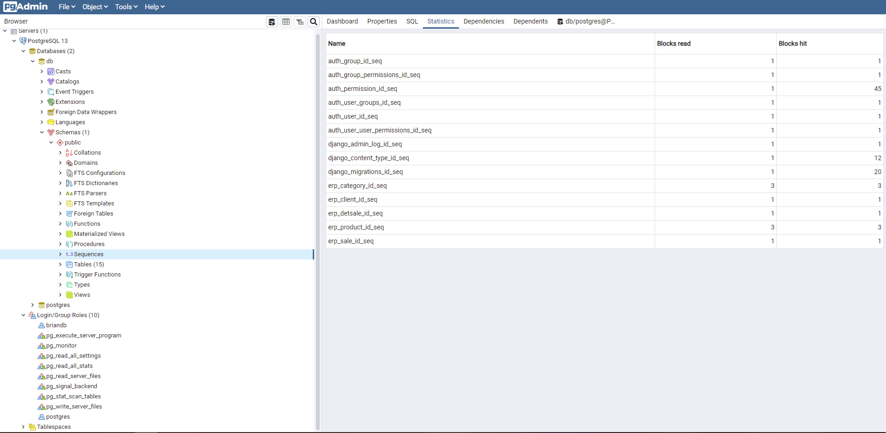

### ListView II Vistas basadas en clases

_Postgres_

```
pip install psycopg2
```

### SQL

```sql
delete from erp_product;
ALTER SEQUENCE erp_product_id_seq RESTART WITH 1;
delete from erp_category;
ALTER SEQUENCE erp_category_id_seq RESTART WITH 1;
```

### DataTable

[https://datatables.net/download/]


