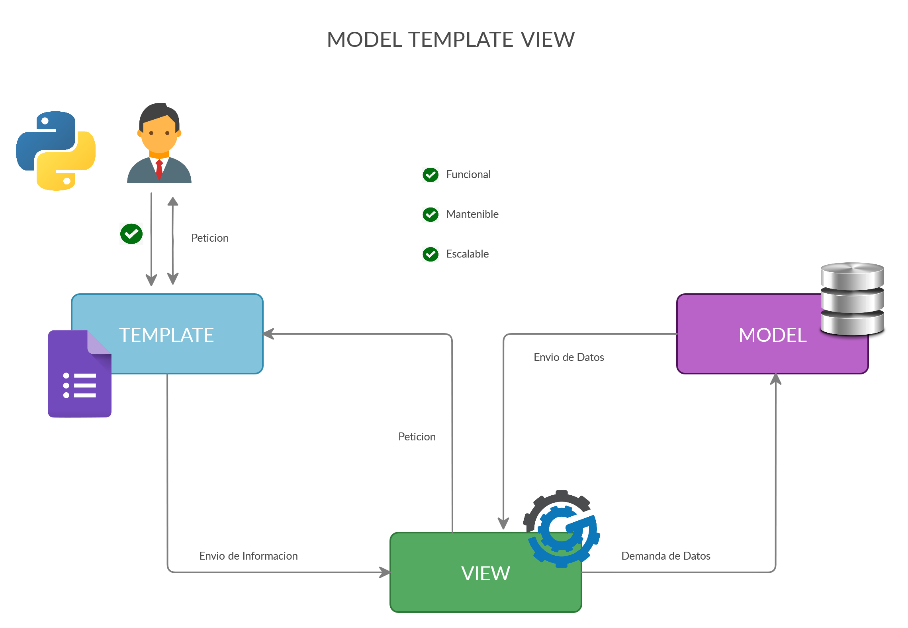
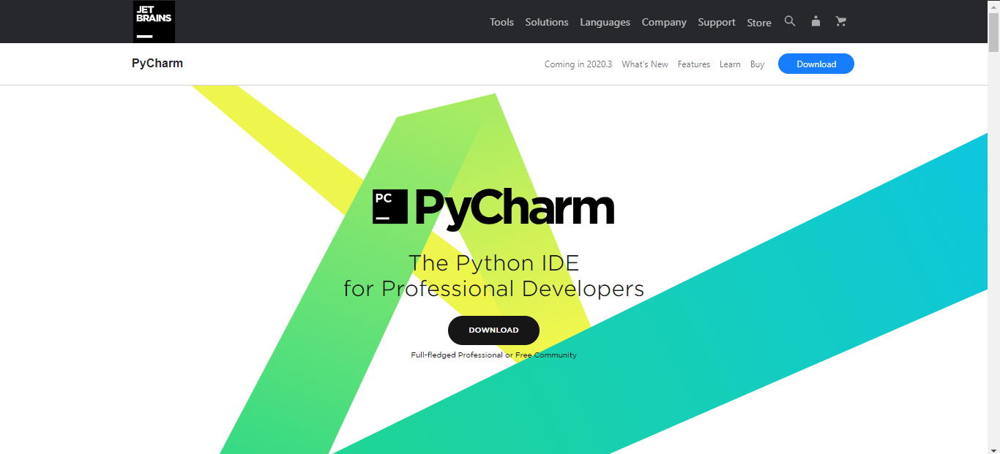
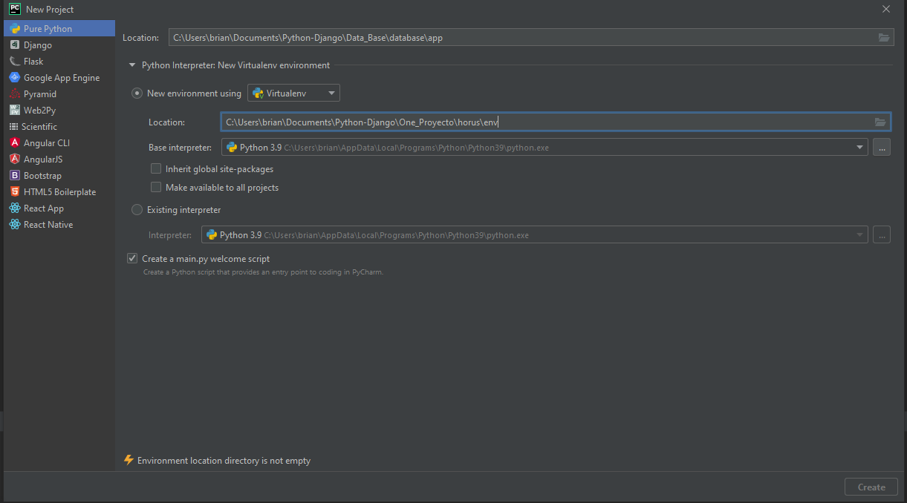
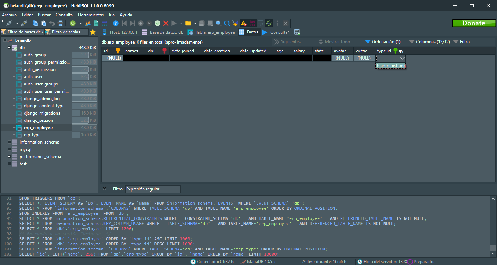
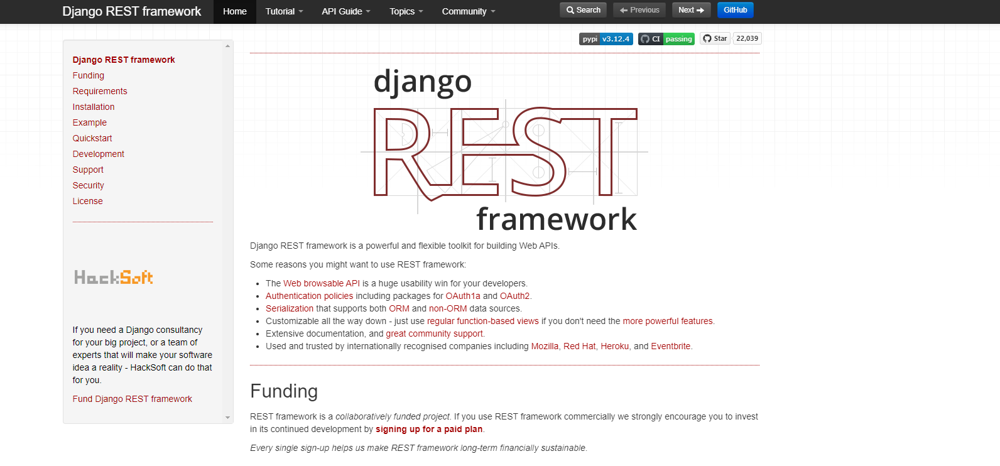
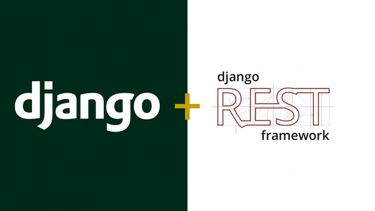

<h2 align="center">🦄Framework Web | Learn Django</h2>

<p align="center">
  
   </a>
    
  </a>
  <a href="https://github.com/BrianMarquez3/Python-Django/stargazers">
    
  </a>
  <a href="https://github.com/BrianMarquez3/Python-Django/network">
    
  </a>
    
  </a>
  
  </a>
    
  </a>
  
  </a>
    
  </a>
  
   </a>
   <a href="https://github.com/BrianMarquez3/Python-Django/network">
    
  </a><br>
 
  
  

<table align="center">
  <tr>
    <td align="center" style="padding=0;width=50%;">
      
    </td>
  </tr>
</table>

[Django Github](https://github.com/django/django)


## Tabla de Contenidos

| Numeration   | Check  |    Topic      |   Quantization   |    Edit Gitpot    |    Downloads    |  link  |
| ------------ |--------|-------------- |----------------- |------------------ |---------------- |-------- |
| 001          |:heavy_check_mark:      | [Que es Django ](#Que-es-Django) |      |   | 💾 | [ ⬅️ Atras](https://github.com/BrianMarquez3) | 
| 002          |:heavy_check_mark:      | [Instalador ](#Instalador) |     |   | 💾 | [ ⬅️ Atras](https://github.com/BrianMarquez3) | 
| 003          |:heavy_check_mark:      | [Modelo Vista Controlador  ](#Modelo-Vista-Controlador) |      |   | 💾 | [ ⬅️ Atras](https://github.com/BrianMarquez3) | 
| 003          |:heavy_check_mark:      | [Características ](#Características) |      |   | 💾 | [ ⬅️ Atras](https://github.com/BrianMarquez3) | 
| 004          |:heavy_check_mark:      |[Principales Comandos ](#Principales-Comandos) |     |   | 💾 | [ ⬅️ Atras](https://github.com/BrianMarquez3) | 
| 005          |:heavy_check_mark:      | [Base de datos](#Base-de-datos) |     |   | 💾 | [ ⬅️ Atras](https://github.com/BrianMarquez3) | 
| 006          |:heavy_check_mark:      | [Manejo de datos por Consola ](#Manejo-de-datos-por-Consola) |     |   | 💾 | [ ⬅️ Atras](https://github.com/BrianMarquez3) | 
| 007          |:heavy_check_mark:      | [Arquitectura](#Arquitectura) |     |   | 💾 | [ ⬅️ Atras](https://github.com/BrianMarquez3) | 
| 008          |:heavy_check_mark:      | [Jerarquia u orden de llamadas desde plantilla](#Jerarquia-u-orden-de-llamadas-desde-plantilla) |     |   | 💾 | [ ⬅️ Atras](https://github.com/BrianMarquez3) | 
| 009          |:heavy_check_mark:      | [API Forms ](#api-form) |     |   | 💾 | [ ⬅️ Atras](https://github.com/BrianMarquez3) | 
| 010          |:heavy_check_mark:      | [Proyecto vs Aplicacion ](#Proyecto-vs-Aplicacion) |     |   | 💾 | [ ⬅️ Atras](https://github.com/BrianMarquez3) | 
| 011          |:heavy_check_mark:      | [Pycharm ](#Pycharm) |     |   | 💾 | [ ⬅️ Atras](https://github.com/BrianMarquez3) | 
| 012          |:heavy_check_mark:      | [Envio de Email ](#Envio-de-Email) |     |   | 💾 | [ ⬅️ Atras](https://github.com/BrianMarquez3) | 
| 013          |:heavy_check_mark:      | [Models ](#Models ) |     |   | 💾 | [ ⬅️ Atras](https://github.com/BrianMarquez3) | 
| 014          |:heavy_check_mark:      | [ORM ](#ORM ) |     |   | 💾 | [ ⬅️ Atras](https://github.com/BrianMarquez3) | 
| 015          |:heavy_check_mark:      | [Archivos estaticos](#Archivos-estaticos) |     |   | 💾 | [ ⬅️ Atras](https://github.com/BrianMarquez3) | 
| 016          |:heavy_check_mark:      | [Views](#views) |     |   | 💾 | [ ⬅️ Atras](https://github.com/BrianMarquez3) | 
| 017          |:heavy_check_mark:      | [Parametros](#Parametros) |     |   | 💾 | [ ⬅️ Atras](https://github.com/BrianMarquez3) | 
| 018          |:heavy_check_mark:      | [Plantillas](#plantillas) |     |   | 💾 | [ ⬅️ Atras](https://github.com/BrianMarquez3) | 
| 019          |:heavy_check_mark:      | [Panel de Administrador](#Panel-de-Administrador) |     |   | 💾 | [ ⬅️ Atras](https://github.com/BrianMarquez3) | 
| 020          |:heavy_check_mark:      | [ListView vistas basadas en clases](#ListView-vistas-basadas-en-clases) |     |   | 💾 | [ ⬅️ Atras](https://github.com/BrianMarquez3) | 
| 021          |:heavy_check_mark:      | [ListView II vistas basadas en clases](#ListView-II-vistas-basadas-en-clases) |     |   | 💾 | [ ⬅️ Atras](https://github.com/BrianMarquez3) | 
| 022          |:heavy_check_mark:      | [Sobreescritura del metodo dispatch](#Sobreescritura-del-metodo-dispatch) |     |   | 💾 |[ ⬅️ Atras](https://github.com/BrianMarquez3) | 
| 023          |:heavy_check_mark:      | [Implementando decoradores](#Implementando-decoradores) |     |   | 💾 | [ ⬅️ Atras](https://github.com/BrianMarquez3) | 
| 024          |:heavy_check_mark:      | [Sobreescritura del metodo post](#Sobreescritura-del-metodo-post) |     |   | 💾 | [ ⬅️ Atras](https://github.com/BrianMarquez3) | 


---


## Fundamentos Django

| Numeration   | Check  |    Topic     |   Quantization   |    Edit Gitpot   |    Downloads     |  link    |
|:------------:|:------:|:------------:|:----------------:|:----------------:|:----------------:|:--------:|
| A1         |:heavy_check_mark:      | [Mysite ](#mysite) |     |   | 💾 | [ ⬅️ Atras](https://github.com/BrianMarquez3) |
| A2         |:heavy_check_mark:      | [Forms Generic Views ](#forms-Generic-Views) |     |   | 💾 | [ ⬅️ Atras](https://github.com/BrianMarquez3) |
| A3         |:heavy_check_mark:      | [Shell ](#shell) |     |   | 💾 | [ ⬅️ Atras](https://github.com/BrianMarquez3) |
| A4         |:heavy_check_mark:      | [Static ](#static) |     |   | 💾 | [ ⬅️ Atras](https://github.com/BrianMarquez3) || A3         |:heavy_check_mark:      | [Shell ](#shell) |     |   | 💾 | [ ⬅️ Atras](https://github.com/BrianMarquez3) |
| A5         |:heavy_check_mark:      | [Template ](#template) |     |   | 💾 | [ ⬅️ Atras](https://github.com/BrianMarquez3) || A3         |:heavy_check_mark:      | [Shell ](#shell) |     |   | 💾 | [ ⬅️ Atras](https://github.com/BrianMarquez3) |
| A6         |:heavy_check_mark:      | [Vista plantillas](#vista-plantillas) |     |   | 💾 | [ ⬅️ Atras](https://github.com/BrianMarquez3) || A3         |:heavy_check_mark:      | [Shell ](#shell) |     |   | 💾 | [ ⬅️ Atras](https://github.com/BrianMarquez3) |
| A7         |:heavy_check_mark:      | [Web dinamica](#web-dinamica) |     |   | 💾 | [ ⬅️ Atras](https://github.com/BrianMarquez3) || A3         |:heavy_check_mark:      | [Shell ](#shell) |     |   | 💾 | [ ⬅️ Atras](https://github.com/BrianMarquez3) |
| A8         |:heavy_check_mark:      | [Web personal](#web-personal) |     |   | 💾 | [ ⬅️ Atras](https://github.com/BrianMarquez3) || A3         |:heavy_check_mark:      | [Shell ](#shell) |     |   | 💾 | [ ⬅️ Atras](https://github.com/BrianMarquez3) |

---

## Django API Rest Framework

| Numeration   | Check  |    Topic     |   Quantization  |    Edit Gitpot    |    Downloads   |  link   |
|:------------:|:------:|:------------:|:----------------:|:----------------:|:----------------:|:--------:|
| B1         |:heavy_check_mark:      | [APP ](#APP) |     |   | 💾 | [ ⬅️ Atras](https://github.com/BrianMarquez3) |
| B2         |:heavy_check_mark:      | [REST API ](#REST-API) |     |   | 💾 | [ ⬅️ Atras](https://github.com/BrianMarquez3) |
| B3         |:heavy_check_mark:      | [Serealizers ](#Serealizers) |     |   | 💾 | [ ⬅️ Atras](https://github.com/BrianMarquez3) |
| B4         |:heavy_check_mark:      | [Viewset ](#Viewset) |     |   | 💾 | [ ⬅️ Atras](https://github.com/BrianMarquez3) |
| B5         |:heavy_check_mark:      | [APIfeed ](#APIfeed) |     |   | 💾 | [ ⬅️ Atras](https://github.com/BrianMarquez3) |
| B6         |:heavy_check_mark:      | [AreaLogin ](#AreaLogin) |     |   | 💾 | [ ⬅️ Atras](https://github.com/BrianMarquez3) |
| B7         |:heavy_check_mark:      | [filtrarUsuarios ](#filtrarUsuarios) |     |   | 💾 | [ ⬅️ Atras](https://github.com/BrianMarquez3) 

---


## Django API Rest Framework Avanzando

Creación y consumo de APIs con Django REST Framework.

| Numeration   | Check  |    Topic     |   Quantization  |    Edit Gitpot    |    Downloads   |  link   |
|:------------:|:------:|:------------:|:----------------:|:----------------:|:----------------:|:--------:|
| C1         |:heavy_check_mark:      | [REST API avanzado](#REST-API-avanzado) |     |   | 💾 | [ ⬅️ Atras](https://github.com/BrianMarquez3) |
| C2         |:heavy_check_mark:      | [REST API avanzado enlistarUsuarios](#REST-API-avanzado-enlistarUsuarios) |     |   | 💾 | [ ⬅️ Atras](https://github.com/BrianMarquez3) |
| C3         |:heavy_check_mark:      | [REST API avanzado ModeloUsuario](#REST-API-avanzado-ModeloUsuario) |     |   | 💾 | [ ⬅️ Atras](https://github.com/BrianMarquez3) |


---

## Que es Django 

Django es un framework de desarrollo web de código abierto, escrito en Python, que respeta el patrón de diseño conocido como MVC (Modelo–Vista–Controlador). Fue desarrollado en origen para gestionar varias páginas orientadas a noticias de la World Company de Lawrence, Kansas, y fue liberada al público bajo una licencia BSD en julio de 2005; el framework fue nombrado en alusión al guitarrista de jazz gitano Django Reinhardt. En junio de 2008 fue anunciado que la recién formada Django Software Foundation se haría cargo de Django en el futuro.

La meta fundamental de Django es facilitar la creación de sitios web complejos. Django pone énfasis en el re-uso, la conectividad y extensibilidad de componentes, el desarrollo rápido y el principio No te repitas (DRY, del inglés Don't Repeat Yourself). Python es usado en todas las partes del framework, incluso en configuraciones, archivos, y en los modelos de datos. [WIKIPEDIA](https://es.wikipedia.org/wiki/Django_(framework)#:~:text=Django%20es%20un%20framework%20de,vista%E2%80%93controlador%20(MVC).&text=En%20junio%20de%202008%20fue,de%20Django%20en%20el%20futuro.) <br>

### Framework

Un Framework es un marco de trabajo formado por un conjunto de herramientas, librerias y buenas practicas.

### Para qué Sirve Django

- Para crear sitios web (Complejos) de forma rapida y sencilla
- Hay tareas que son repetitivas, pesadas y comunes en el momento de crear deferentes sitios web, django viene a facilitar la realizacion de estas tareas.
- Hay codigos que podemos reutilizar de un sitio web a otro, Django tambien nos permite esta reutilizacion de forma sencilla.

---

## Instalador

📦 [Install Django](https://www.djangoproject.com/) Intalador de Django.<br>
📦 [Install PyCham](https://www.jetbrains.com/es-es/pycharm/download/#section=windows) Intalador de PyCham.<br>
📦 [Install Python](https://www.python.org/) Instalador de Python.<br>

---
##  Modelo Vista Controlador 

- Model Template View


---
## Características

- Un mapeador objeto-relacional.
- Aplicaciones "enchufables" que pueden instalarse en cualquier página gestionada con Django.
- Una API de base de datos robusta.
- Un sistema incorporado de "vistas genéricas" que ahorra tener que escribir la lógica de ciertas tareas comunes.
- Un sistema extensible de plantillas basado en etiquetas, con herencia de plantillas.
- Un despachador de URLs basado en expresiones regulares.
- Soporte de internacionalización, incluyendo traducciones incorporadas de la interfaz de administración.

---

## Principales Comandos

_Instalar Django_

[www.djangoproject.com](https://www.djangoproject.com/download/)

_Actualiza Django_

```python
pip install --upgrade Django
```

_Actualizar PIP_

```python
pip install --upgrade pip
```

_Django Version_

```
pip install Django==3.2.8
```

_Crear Entornos Virtuales y Paquetes(env)_

```python
python -m venv env
```

_Activar Entorno Virtuale y Paquete(env)_

```
env\Scripts\activate
```

_Instalar requirements.txt_

```python
pip install -r requirements.txt
```

_Version de Django_

```python
python -m django --version
```

_Primer Projecto_

```
django-admin startproject nombreProyecto
```

_Ejecutar Servidor Django_

```python
python manage.py runserver
```
_Crear Aplicacion_

```python
python manage.py startapp nombreAplicacion
```

_Check de la Aplicacion_

```python
python manage.py check nombreAplicacion
```

_Generar la Base de Datos_

```python
python manage.py makemigrations
```

_Generar Codigo SQL_

```python
python manage.py sqlmigrate nombreAplicacion 000n
```
_Migrate_

```python
python manage.py migrate
```

_mysqlclient_

```python
pip install mysqlclient
```

_Django- yodbc azure_

```python
pip install django-pyodbc-azure
```

_Crear listado de requerimeintos_

```python
python freeze > requerimientos.txt
```

_Crear un superusuario_

```python
python manage.py createsuperuser
```

_Shell_

```
python manage.py shell
```


---
## Base de datos

_Principales conectores a gestores de base de datos_
### Crear Super Usuario

```python
python manage.py createsuperuser
```

### Conector PostgreSQL

_Driver_
```
pip install psycopg2
```

_Libreria_
```
pip install mysqlclient
```
```python
DATABASES = {
    'default': {
        'ENGINE': 'django.db.backends.postgresql_psycopg2',
        'NAME': 'articulosclientes',
        'USER': 'briandb',
        'PASSWORD': 'briandb',
        'HOST': '127.0.0.1',
        'DATABASE_PORT': '5432',
}
```

### Conector Mysql/MariaDb 

```
pip3 install mariadb
```

```
pip install mysqlclient
```

```python
DATABASES = {
    'default': {
        'ENGINE': 'django.db.backends.mysql',
        'NAME': 'articulosclientes',
        'USER': 'briandb',
        'PASSWORD': 'briandb',
        'HOST': '127.0.0.1',
        'PORT': 3307,
    }
}
```
### Conector SQLSERVER

_Driver_
```
https://www.microsoft.com/es-es/download/details.aspx?id=56567

```
_Libreria_

```
pip install pyodbc
```

_Conectar Python Django con SQL Server_

```python
DATABASES = {
    'default': {
        'ENGINE': 'sql_server.pyodbc',
        'NAME': 'db_almacen',
        'USER': 'usr_almacen',
        'PASSWORD': 'mipassword',
        'HOST': '127.0.0.1',
        'PORT': '1433',

        'OPTIONS': {
            'driver': 'ODBC Driver 13 for SQL Server',
        },
    }
}
```
### Django BBDD

Soportados Oficialmente:
- SQLite3 : Gestor de BBDD por defecto
- PostgreSQL: Gestor Recomendado
- MySql
- Oracle

Con conectores ofrecidos por terceros:
- SQL Server
- SAP SQL
- DB2
- Firebird


| Carpeta                    | Link         |     Home   |  Code       | Version | Estado |
|----------------------------|:-----------:|:-----------:|:-----------:|:-----------:|:-----------:|
| [BAse de Datos Config](Data_Base_Config)          |      ✔️     | [⬅️Atras](#Tabla-de-contenidos) | yes | yes | ✔️ |

---
## Manejo de datos por Consola
### Insertar datos BBDD - Consola

```python
from nombreAplicacion.models import nombreTabla
art=nombreTabla(inten1='nombre', iten2='nombre', iten3=numero)
art.save()
#art2= nombreTabla.objects.create(iten1="nombre", iten2="campo", iten3=numero)   
```
### Actualizar datos BBDD - Consola

```python
from nombreAplicacion.models import nombreTabla
art.precio=100 
art.save
```

### Borrar datos BBDD - Consola

```python
from nombreAplicacion.models import nombreTabla
variableborrar=nombeTabla.objects.get(id=3) 
variableborrar.delete()
```
---

## Arquitectura

Aunque Django está fuertemente inspirado en la filosofía de desarrollo Modelo Vista Controlador, sus desarrolladores declaran públicamente que no se sienten especialmente atados a observar estrictamente ningún paradigma particular, y en cambio prefieren hacer "lo que les parece correcto". Como resultado, por ejemplo, lo que se llamaría "controlador" en un "verdadero" framework MVC se llama en Django "vista", y lo que se llamaría "vista" se llama "plantilla". [WIKIPEDIA](https://es.wikipedia.org/wiki/Django_(framework)).<br>

- Presentacion
- Control
- Mediator
- Entity
- Foundation

---
## Jerarquia u orden de llamadas desde plantilla

-   Diccionario
-   Atributo
-   Metodo
-   Indice de lista

---


## API FORM

```
from nombreAplicacion.forms import FormularioContacto 
miformulario = FormularioContacto()
```
_Mostrar Formulario_
print(miformulario)

| Carpeta                    | Link         |     Home   |  Code       | Version | Estado |
|----------------------------|:-----------:|:-----------:|:-----------:|:-----------:|:-----------:|
| [API FORM](https://github.com/BrianMarquez3/Python-Django/tree/master/API_Forms)          |      ✔️     | [⬅️Atras](#Tabla-de-contenidos) | yes | yes | ✔️ |

---

## Proyecto vs Aplicacion


## Pycharm

_Pagina Principal_ [ JETBRAINS](https://www.jetbrains.com/es-es/pycharm/).<br>



### Configuración Entorno Pycharm

_Pantalla de creacion de Proyecto_



- Carpeta
    -   app : Aqui se coloca todos lo archivos
    -   env : Aqui Se coloca la version Python

---
## Envio de Email
_Incresar en el Archivo Setting_

```python
EMAIL_BACKEND = 'django.core.mail.backends.smtp.EmailBackend'
EMAIL_HOST="smtp.gmail.com"
EMAIL_USE_TLS=True
EMAIL_PORT=587
EMAIL_HOST_USER="tuemail@gmail.com"
EMAIL_HOST_PASSWORD="tupassword"
EMAIL_USE_TLS = True
EMAIL_USE_SSL = False
```

- Ingresar al Shell para las Pruebas
```
from django.core.mail import send_mail   
```
```
send_mail('el asusntoo', 'mensaje del correo, 'tu correo', ['correo destinatario'], fail_silently=False,)
```

| Carpeta                    | Link |     Home   |  Code | Version | Estado |
|----------------------------|:-----------:|:-----------:|:-----------:|:-----------:|:-----------:|
| [Envio de Email](https://github.com/BrianMarquez3/Python-Django/tree/master/TiendaOnline_EnvioEmails)          |      ✔️     |[⬅️Atras](#Tabla-de-contenidos) | yes | yes | ✔️ | 

---
## Models 

Un modelo es la fuente única y definitiva de información sobre sus datos. Contiene los campos y comportamientos esenciales de los datos que está almacenando. Generalmente, cada modelo se asigna a una sola tabla de base de datos.
[DOCS.DJANGOPROJECT](https://docs.djangoproject.com/en/3.1/topics/db/models/).<br>



| Carpeta                    | Link |     Home   |  Code | Version | Estado |
|----------------------------|:-----------:|:-----------:|:-----------:|:-----------:|:-----------:|
| [Model](https://github.com/BrianMarquez3/Python-Django/tree/master/Models)          |      ✔️     |  [⬅️Atras](#Tabla-de-contenidos) | yes | yes | ✔️ |
| [Model Relaciones](https://github.com/BrianMarquez3/Python-Django/tree/master/Models_II_Relaciones)          |      ✔️     | [⬅️Atras](#Tabla-de-contenidos) | yes | yes | ✔️ | 


---

## ORM

Un ORM es un modelo de programación que permite mapear las estructuras de una base de datos relacional (SQL Server, Oracle, MySQL, etc.), en adelante RDBMS (Relational Database Management System), sobre una estructura lógica de entidades con el objeto de simplificar y acelerar el desarrollo de nuestras aplicaciones.


| Carpeta                    | Link |     Home   |  Code | Version | Estado |
|----------------------------|:-----------:|:-----------:|:-----------:|:-----------:|:-----------:|
| [ORM I](https://github.com/BrianMarquez3/Python-Django/tree/master/ORM)          |      ✔️     | [⬅️Atras](#Tabla-de-contenidos) | yes | yes | ✔️ |
| [ORM II](https://github.com/BrianMarquez3/Python-Django/tree/master/ORM_II)          |      ✔️     | [⬅️Atras](#Tabla-de-contenidos) | yes | yes | ✔️ |

---

## Archivos estaticos

- Archivos Estaticos
  
[Documentacion Django](https://docs.djangoproject.com/en/3.1/howto/static-files/) Archivos Estaticos.<br>
  
- Bootstrap

[Bootstrap](https://getbootstrap.com/docs/5.0/getting-started/download/) Descargar Bootstrap.<br>

- Ejemplo

[w3schools](https://www.w3schools.com/bootstrap4/bootstrap_get_started.asp) Ejemplo.<br>

| Carpeta                    | Link |     Home   |  Code | Version | Estado |
|----------------------------|:-----------:|:-----------:|:-----------:|:-----------:|:-----------:|
| [Archivos_estaticos](https://github.com/BrianMarquez3/Python-Django/tree/master/Archivos_estaticos)          |      ✔️     |  [⬅️Atras](#Tabla-de-contenidos) | yes | yes | ✔️ |


---
## Views

* VIEW
_Modelo Vista controlador_
```
M = Modelo (Base de Datos)
V = Vista
C = Controlador (Funciones)
```

_Modelo Vista Template_

```
M = Modelo (Base de Datos)
V = Vista (Funciones)
C = Templates (Pantallas)
```

| Carpeta                    | Link |     Home   |  Code | Version | Estado |
|----------------------------|:-----------:|:-----------:|:-----------:|:-----------:|:-----------:|
| [Mi Primera View](https://github.com/BrianMarquez3/Python-Django/tree/master/Mi_primera_view)          |      ✔️     |  [⬅️Atras](#Tabla-de-contenidos) | yes | yes | ✔️ |

---
## Parametros

| Carpeta                    | Link |     Home   |  Code | Version | Estado |
|----------------------------|:-----------:|:-----------:|:-----------:|:-----------:|:-----------:|
| [Paramentros URL](https://github.com/BrianMarquez3/Python-Django/tree/master/ParametroURL)          |     ✔️     |  [⬅️Atras](#Tabla-de-contenidos) | yes | yes | ✔️ |
| [Parametros En URL](https://github.com/BrianMarquez3/Python-Django/tree/master/ParametrosEnURL)          |     ✔️     |  [⬅️Atras](#Tabla-de-contenidos) | yes | yes | ✔️ |

---
## Plantillas

| Carpeta                    | Link |     Home   |  Code | Version | Estado |
|----------------------------|:-----------:|:-----------:|:-----------:|:-----------:|:-----------:|
| [PLantillas I](https://github.com/BrianMarquez3/Python-Django/tree/master/Plantillas)          |      ✔️     |  [⬅️Atras](#Tabla-de-contenidos) | yes | yes | ✔️ |
| [PLantillas II](https://github.com/BrianMarquez3/Python-Django/tree/master/PlantillasII)          |     ✔️     |  [⬅️Atras](#Tabla-de-contenidos) | yes | yes | ✔️ |
| [PLantillas III](https://github.com/BrianMarquez3/Python-Django/tree/master/PlantillasIII)          |     ✔️     |  [⬅️Atras](#Tabla-de-contenidos) | yes | yes | ✔️ |
| [PLantillas IV](https://github.com/BrianMarquez3/Python-Django/tree/master/PlantillasIV)          |      ✔️     |  [⬅️Atras](#Tabla-de-contenidos) | yes | yes | ✔️ |
| [PLantillas V ](https://github.com/BrianMarquez3/Python-Django/tree/master/PlantillasV)          |     ✔️     |  [⬅️Atras](#Tabla-de-contenidos) | yes | yes | ✔️ |
| [PLantillas IV](https://github.com/BrianMarquez3/Python-Django/tree/master/PlantillasVI)          |     ✔️     |  [⬅️Atras](#Tabla-de-contenidos) | yes | yes | ✔️ |
| [Templates I](https://github.com/BrianMarquez3/Python-Django/tree/master/Templates_I)          |     ✔️     |  [⬅️Atras](#Tabla-de-contenidos) | yes | yes | ✔️ |
| [Templates II](https://github.com/BrianMarquez3/Python-Django/tree/master/Templates_II)          |     ✔️     |  [⬅️Atras](#Tabla-de-contenidos) | yes | yes | ✔️ |
| [Templates Integrando Platntilla adminLT3](https://github.com/BrianMarquez3/Python-Django/tree/master/Templates_III_%20Integrando_Platntilla_adminLT3)          |     ✔️     |  [⬅️Atras](#Tabla-de-contenidos) | yes | yes | ✔️ |

---

## Panel de Administrador

| Carpeta                    | Link |     Home   |  Code | Version | Estado |
|----------------------------|:-----------:|:-----------:|:-----------:|:-----------:|:-----------:|
| [Panel de Adminitracion](https://github.com/BrianMarquez3/Python-Django/tree/master/panel_administrador)          |      ✔️     |  [⬅️Atras](#Tabla-de-contenidos) | yes | yes | ✔️ |    | 


## ListView vistas basadas en clases


| Carpeta                    | Link |     Home   |  Code | Version | Estado |
|----------------------------|:-----------:|:-----------:|:-----------:|:-----------:|:-----------:|
| [ListView_vistas_basadas_en_clases](https://github.com/BrianMarquez3/Python-Django/tree/master/ListView_vistas_basadas_en_clases)          |      ✔️     |  [⬅️Atras](#Tabla-de-contenidos) | yes | yes | ✔️ |

---

## ListView II vistas basadas en clases


| Carpeta                    | Link |     Home   |  Code | Version | Estado |
|----------------------------|:-----------:|:-----------:|:-----------:|:-----------:|:-----------:|
| [ListView II_vistas_basadas_en_clases](https://github.com/BrianMarquez3/Python-Django/tree/master/ListView_II_Vistas_basadas_en_clases)          |      ✔️     |  [⬅️Atras](#Tabla-de-contenidos) | yes | yes | ✔️ |

---

## Sobreescritura del metodo dispatch 

| Carpeta                    | Link |     Home   |  Code | Version | Estado |
|----------------------------|:-----------:|:-----------:|:-----------:|:-----------:|:-----------:|
| [Sobreescritura del metodo dispatch](https://github.com/BrianMarquez3/Python-Django/tree/master/Sobreescritura_del_metodo_dispatch)          |    ✔️     |  [⬅️Atras](#Tabla-de-contenidos) | yes | yes | ✔️ |

---

## Implementando decoradores

_Documentacion_

[Decoradores Django](https://pywombat.com/articles/decoradores-django)

| Carpeta                    | Link |     Home   |  Code | Version | Estado |
|----------------------------|:-----------:|:-----------:|:-----------:|:-----------:|:-----------:|
| [Implementando decoradores](https://github.com/BrianMarquez3/Python-Django/tree/master/Implementando_decoradores)          | ✔️     |  [⬅️Atras](#Tabla-de-contenidos) | yes | yes | ✔️ |     ✔️     |


## Sobreescriturdel metodo post

|Number   | Carpeta                    | Link |     Home   |  Code | Version | Estado |
|:-------:|----------------------------|:-----------:|:-----------:|:-----------:|:-----------:|:-----------:|
|024| [Sobreescriturdel metodo post](https://github.com/BrianMarquez3/Python-Django/tree/master/Sobreescritura_del_metodo_dispatch)          | ✔️     |  [⬅️Atras](#Tabla-de-contenidos) | yes | yes | ✔️ |     ✔️     |


---

**Fundamentos en Django**

<table align="center">
  <tr>
    <td align="center" style="padding=0;width=50%;">
      
    </td>
  </tr>
</table>


## Mysite

- Solicitudes y respuestas
- Modelos y sitio de administración 

Mas Informacion documentacion [docs.djangoproject](https://docs.djangoproject.com/en/3.2/)


|Number   | Carpeta                    | Link        |   Code      | Version     | Estado      |  Home     |
|:-------:|----------------------------|:-----------:|:-----------:|:-----------:|:-----------:|:---------:|
|A1| [Mysite](https://github.com/BrianMarquez3/Python-Django/tree/master/mysite)       | ✔️ |  yes |  yes | ✔️ |     ✔️     |  [⬅️Atras](#Fundamentos-Django) |


## SHELL - Demo

```
>>> python manage.py shell
```

```
>>> Post.objects.first()
```

```
>>> Post.objects.get() 
```

```
>>> post = Post.objects.create(title="Mi segundo Blog", content="Contenido de segundo blog")
>>> post.title = "otro blog"
>>> post.save()
```

## Forms Generic Views

|Number   | Carpeta                    | Link        |   Code      | Version     | Estado      |  Home     |
|:-------:|----------------------------|:-----------:|:-----------:|:-----------:|:-----------:|:---------:|
|A2| [Forms Generic Views](https://github.com/BrianMarquez3/Python-Django/tree/master/formsGenericViews)       | ✔️ |  yes |  yes | ✔️ |     ✔️     |  [⬅️Atras](#Fundamentos-Django) |


## Shell

|Number   | Carpeta                    | Link        |   Code      | Version     | Estado      |  Home     |
|:-------:|----------------------------|:-----------:|:-----------:|:-----------:|:-----------:|:---------:|
|A3| [Shell](https://github.com/BrianMarquez3/Python-Django/tree/master/shell)       | ✔️ |  yes |  yes | ✔️ |     ✔️     |  [⬅️Atras](#Fundamentos-Django) |

## Static

|Number   | Carpeta                    | Link        |   Code      | Version     | Estado      |  Home     |
|:-------:|----------------------------|:-----------:|:-----------:|:-----------:|:-----------:|:---------:|
|A4| [Static](https://github.com/BrianMarquez3/Python-Django/tree/master/static)       | ✔️ |  yes |  yes | ✔️ |     ✔️     |  [⬅️Atras](#Fundamentos-Django) |

## Template

|Number   | Carpeta                    | Link        |   Code      | Version     | Estado      |  Home     |
|:-------:|----------------------------|:-----------:|:-----------:|:-----------:|:-----------:|:---------:|
|A4| [Template](https://github.com/BrianMarquez3/Python-Django/tree/master/templates)       | ✔️ |  yes |  yes | ✔️ |     ✔️     |  [⬅️Atras](#Fundamentos-Django) |

## Vista plantillas

|Number   | Carpeta                    | Link        |   Code      | Version     | Estado      |  Home     |
|:-------:|----------------------------|:-----------:|:-----------:|:-----------:|:-----------:|:---------:|
|A5| [Vista plantillas](https://github.com/BrianMarquez3/Python-Django/tree/master/vistasPlantillas)       | ✔️ |  yes |  yes | ✔️ |     ✔️     |  [⬅️Atras](#Fundamentos-Django) |

## Web dinamica

|Number   | Carpeta                    | Link        |   Code      | Version     | Estado      |  Home     |
|:-------:|----------------------------|:-----------:|:-----------:|:-----------:|:-----------:|:---------:|
|A| [Web Dinamica](https://github.com/BrianMarquez3/Python-Django/tree/master/webDinamica)       | ✔️ |  yes |  yes | ✔️ |     ✔️     |  [⬅️Atras](#Fundamentos-Django) |

## Web personal 

|Number   | Carpeta                    | Link        |   Code      | Version     | Estado      |  Home     |
|:-------:|----------------------------|:-----------:|:-----------:|:-----------:|:-----------:|:---------:|
|A| [Web personal](https://github.com/BrianMarquez3/Python-Django/tree/master/webpersonal)       | ✔️ |  yes |  yes | ✔️ |     ✔️     |  [⬅️Atras](#Fundamentos-Django) |


---

**Djando Api Rest Framenwork**

<table align="center">
  <tr>
    <td align="center" style="padding=0;width=50%;">
      
    </td>
  </tr>
</table>

Documentacion [Django Api REST Framework ](https://www.django-rest-framework.org/)


## APP

|Number   | Carpeta                    | Link        |   Code      | Version     | Estado      |  Home     |
|:-------:|----------------------------|:-----------:|:-----------:|:-----------:|:-----------:|:---------:|
|B1| [APP](https://github.com/BrianMarquez3/Python-Django/tree/master/App)      | ✔️ |  yes |  yes | ✔️ |     ✔️     |  [⬅️Atras](#Django-API-Rest-Framework) |

## REST API

|B2| [REST API](https://github.com/BrianMarquez3/Python-Django/tree/master/REST_API)      | ✔️ |  yes |  yes | ✔️ |     ✔️     |  [⬅️Atras](#Django-API-Rest-Framework) |

## Serealizers

|B3| [Serealizers](https://github.com/BrianMarquez3/Python-Django/tree/master/Serealizers)      | ✔️ |  yes |  yes | ✔️ |     ✔️     |  [⬅️Atras](#Django-API-Rest-Framework) |


## Viewset

|B4| [Viewset](https://github.com/BrianMarquez3/Python-Django/tree/master/viewSets)      | ✔️ |  yes |  yes | ✔️ |     ✔️     |  [⬅️Atras](#Django-API-Rest-Framework) |


## APIfeed

|B5| [APIfeed](https://github.com/BrianMarquez3/Python-Django/tree/master/APIfeed)      | ✔️ |  yes |  yes | ✔️ |     ✔️     |  [⬅️Atras](#Django-API-Rest-Framework) |

## AreaLogin

|B6| [AreaLogin](https://github.com/BrianMarquez3/Python-Django/tree/master/AreaLogin)      | ✔️ |  yes |  yes | ✔️ |     ✔️     |  [⬅️Atras](#Django-API-Rest-Framework) |


## filtrarUsuarios

|B7| [filtrarUsuarios](https://github.com/BrianMarquez3/Python-Django/tree/master/filtrarUsuarios)      | ✔️ |  yes |  yes | ✔️ |     ✔️     |  [⬅️Atras](#Django-API-Rest-Framework) |


---

<table align="center">
  <tr>
    <td align="center" style="padding=0;width=50%;">
      
    </td>
  </tr>
</table>

## REST API avanzado

|C1| [REST API avanzado](https://github.com/BrianMarquez3/Python-Django/tree/master/REST_API_avanzado)      | ✔️ |  yes |  yes | ✔️ |     ✔️     |  [⬅️Atras](Django-API-Rest-Framework-Avanzando) |


## REST API avanzado enlistarUsuarios


|C2| [REST API avanzado enlistarUsuarios](h)      | ✔️ |  yes |  yes | ✔️ |     ✔️     |  [⬅️Atras](Django-API-Rest-Framework-Avanzando) |

## REST API avanzado ModeloUsuario

|C3| [REST API avanzado ModeloUsuario]()      | ✔️ |  yes |  yes | ✔️ |     ✔️     |  [⬅️Atras](Django-API-Rest-Framework-Avanzando) |


---


## Books

<table>

  <tr>
      <td>Server</td>
      <td>Name</td>
      <td>Authors</td>
      <td>Editorial</td>
      <td>ISBN</td>
      <td>Link</td>
  </tr>

  <tr>
      <td>OneDrive</td>
      <td>Lightweight Django</td>
      <td>Julia Elman, Mark Lavin</td>
      <td>O'REILLY</td>
      <td> 978-1-491-94594-0</td>
      <td><a href="https://ucsmedu-my.sharepoint.com/:b:/g/personal/47092136_ucsm_edu_pe/EQeNs6BGoM9ItgPgwJwK0xkBFIDhN9ChVugFrms984V5bw?e=SeRB5w">Lightweight Django</a></td>
  </tr>

</table>

## Spotify Django

Music Python [List on Spotify](https://open.spotify.com/playlist/11AwbhmXyh2jKlsHmaxcP9)


---

## Paypal

🩸 Invitame un Cafe  [PAYPAL](https://www.paypal.com/donate?hosted_button_id=98U3T62494H9Y) 🍵

---

 <table align="center">
    <tr>
      <td colspan="3">A</td>
        <td>B</td>
      </tr>
      <tr>
        <td>C</td>
      <td colspan="2"></td>
        <td>E</td>
      </tr>
      <tr>
      <td colspan="3">F</td>
        <td>G</td>
    </tr>
</table>