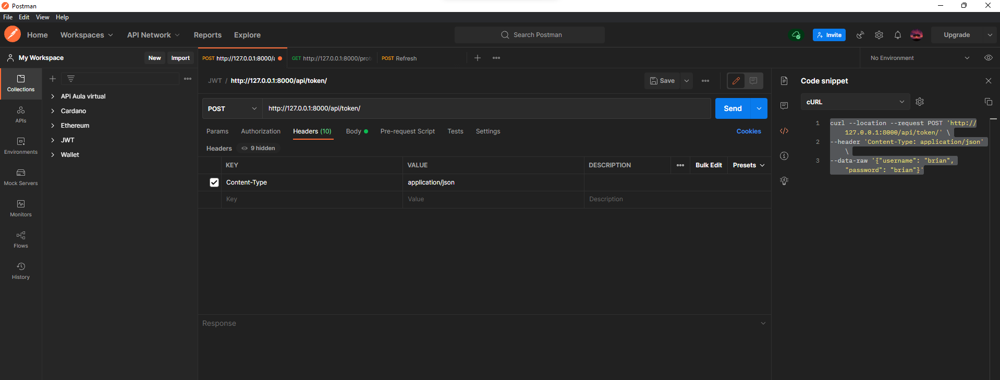

## JWT

[JWT](htts://coffeebytes.dev/django-rest-framework-y-jwt-para-autenticar-usuarios/)

## CURL

```curl
curl --location --request POST 'http://127.0.0.1:8000/api/token/' \
--header 'Content-Type: application/json' \
--data-raw '{"username": "brian", "password": "brian"}'
```

<table align="center">
  <tr>
    <td align="center" style="padding=0;width=50%;">
      
    </td>
  </tr>
</table>

## LINKS

* Pipenv(Entorno Virtual):


Encontrar un entorno virtual con pipenv

```
pipenv --venv
```

Link - [Pipenv(Entorno Virtual)](https://coffeebytes.dev/pipenv-el-administrador-de-entornos-virtuales-que-no-conoces/)

* Time

Link - [Time](https://www.programiz.com/python-programming/time#:~:text=time(),the%20point%20where%20time%20begins).)


* Linux Comandos

Links - [Comands Linux](https://coffeebytes.dev/comandos-de-linux-que-deberias-conocer-tercera-parte/)